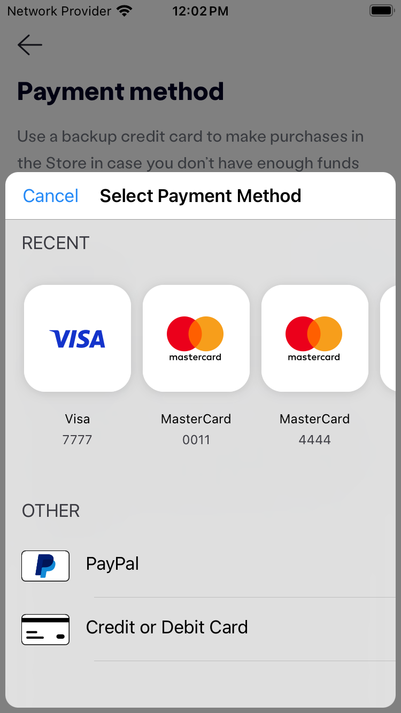

# react-native-braintree-dropin-wrapper

This is a React Native module for integrating the Braintree Drop-In Payment UI into your mobile application.

## Installation

```
 npm i react-native-braintree-dropin-wrapper

 or

 yarn add react-native-braintree-dropin-wrapper

```

## Usage

```
import { showDropIn } from "react-native-braintree-dropin-wrapper";

showDropIn({
      token: '// your client token here',
    })
      .then((result) => ({ // do stuff here }))
      .catch((error) => ({ // handle error here }));

```

## Important Note

### Android

Additionally, add the following Maven repository and (non-sensitive) credentials to your app-level gradle:

```groovy
repositories {
    maven {
        url "https://cardinalcommerceprod.jfrog.io/artifactory/android"
        credentials {
            username 'braintree_team_sdk'
            password 'AKCp8jQcoDy2hxSWhDAUQKXLDPDx6NYRkqrgFLRc3qDrayg6rrCbJpsKKyMwaykVL8FWusJpp'
        }
    }
}
```

In your `AndroidManifest.xml` file, you need to add the following code inside the `<application>` tag:

```xml
<activity
    android:name="com.ehtishamali042.RNBraintreeDropIn.RNBraintreeDropInActivity"
    android:exported="false"
    android:theme="@style/MyTransparentTheme">
</activity>
```

### IOS

Add this in your ios/Podfile
`pod 'BraintreeDropIn', '9.12.2', :modular_headers => true`

## Demo

| iOS                                                                 | Android                                                             |
| ------------------------------------------------------------------- | ------------------------------------------------------------------- |
|  |  |

